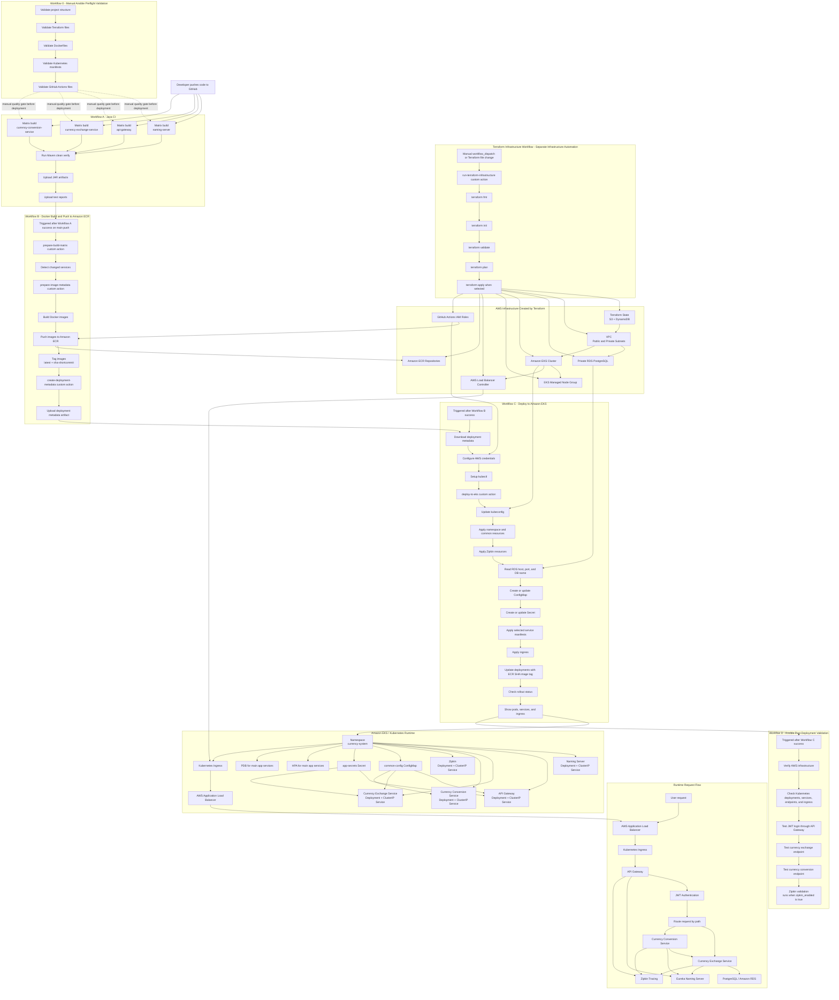

# End-to-End System Diagram

```mermaid
flowchart TD
    A[Developer pushes code to GitHub]

    subgraph TERRAFORM[Terraform Infrastructure Workflow - Separate Infrastructure Automation]
        TF1[Manual workflow_dispatch or Terraform file change]
        TF2[run-terraform-infrastructure custom action]
        TF3[terraform fmt]
        TF4[terraform init]
        TF5[terraform validate]
        TF6[terraform plan]
        TF7[terraform apply when selected]
        TF1 --> TF2 --> TF3 --> TF4 --> TF5 --> TF6 --> TF7
    end

    subgraph AWS[AWS Infrastructure Created by Terraform]
        AWS1[Terraform State<br/>S3 + DynamoDB]
        AWS2[VPC<br/>Public and Private Subnets]
        AWS3[Private RDS PostgreSQL]
        AWS4[Amazon EKS Cluster]
        AWS5[EKS Managed Node Group]
        AWS6[AWS Load Balancer Controller]
        AWS7[Amazon ECR Repositories]
        AWS8[GitHub Actions IAM Roles]
        AWS1 --> AWS2
        AWS2 --> AWS3
        AWS2 --> AWS4
        AWS4 --> AWS5
        AWS4 --> AWS6
        AWS7
        AWS8
    end

    subgraph PRECHECK[Workflow 0 - Manual Ansible Preflight Validation]
        P1[Validate project structure]
        P2[Validate Terraform files]
        P3[Validate Dockerfiles]
        P4[Validate Kubernetes manifests]
        P5[Validate GitHub Actions files]
        P1 --> P2 --> P3 --> P4 --> P5
    end

    subgraph CI[Workflow A - Java CI]
        C1[Matrix build<br/>naming-server]
        C2[Matrix build<br/>api-gateway]
        C3[Matrix build<br/>currency-exchange-service]
        C4[Matrix build<br/>currency-conversion-service]
        C5[Run Maven clean verify]
        C6[Upload JAR artifacts]
        C7[Upload test reports]
        C1 --> C5
        C2 --> C5
        C3 --> C5
        C4 --> C5
        C5 --> C6 --> C7
    end

    subgraph BUILD[Workflow B - Docker Build and Push to Amazon ECR]
        B1[Triggered after Workflow A success on main push]
        B2[prepare-build-matrix custom action]
        B3[Detect changed services]
        B4[prepare-image-metadata custom action]
        B5[Build Docker images]
        B6[Push images to Amazon ECR]
        B7[Tag images<br/>latest + sha-shortcommit]
        B8[create-deployment-metadata custom action]
        B9[Upload deployment metadata artifact]
        B1 --> B2 --> B3 --> B4 --> B5 --> B6 --> B7 --> B8 --> B9
    end

    subgraph DEPLOY[Workflow C - Deploy to Amazon EKS]
        D1[Triggered after Workflow B success]
        D2[Download deployment metadata]
        D3[Configure AWS credentials]
        D4[Setup kubectl]
        D5[deploy-to-eks custom action]
        D6[Update kubeconfig]
        D7[Apply namespace and common resources]
        D8[Apply Zipkin resources]
        D9[Read RDS host, port, and DB name]
        D10[Create or update ConfigMap]
        D11[Create or update Secret]
        D12[Apply selected service manifests]
        D13[Apply ingress]
        D14[Update deployments with ECR SHA image tag]
        D15[Check rollout status]
        D16[Show pods, services, and ingress]
        D1 --> D2 --> D3 --> D4 --> D5 --> D6 --> D7 --> D8 --> D9 --> D10 --> D11 --> D12 --> D13 --> D14 --> D15 --> D16
    end

    subgraph K8S[Amazon EKS / Kubernetes Runtime]
        K1[Namespace<br/>currency-system]

        K2[Naming Server<br/>Deployment + ClusterIP Service]
        K3[API Gateway<br/>Deployment + ClusterIP Service]
        K4[Currency Exchange Service<br/>Deployment + ClusterIP Service]
        K5[Currency Conversion Service<br/>Deployment + ClusterIP Service]
        K6[Zipkin<br/>Deployment + ClusterIP Service]

        K7[common-config ConfigMap]
        K8[app-secrets Secret]
        K9[HPA for main app services]
        K10[PDB for main app services]
        K11[Kubernetes Ingress]
        K12[AWS Application Load Balancer]

        K1 --> K2
        K1 --> K3
        K1 --> K4
        K1 --> K5
        K1 --> K6
        K1 --> K7
        K1 --> K8
        K1 --> K9
        K1 --> K10
        K1 --> K11

        K7 --> K3
        K7 --> K4
        K7 --> K5

        K8 --> K3
        K8 --> K4

        K11 --> K12
    end

    subgraph RUNTIME[Runtime Request Flow]
        R1[User request]
        R2[AWS Application Load Balancer]
        R3[Kubernetes Ingress]
        R4[API Gateway]
        R5[JWT Authentication]
        R6[Route request by path]
        R7[Currency Exchange Service]
        R8[Currency Conversion Service]
        R9[PostgreSQL / Amazon RDS]
        R10[Eureka Naming Server]
        R11[Zipkin Tracing]

        R1 --> R2 --> R3 --> R4 --> R5 --> R6
        R6 --> R7
        R6 --> R8
        R8 --> R7
        R7 --> R9

        R4 --> R10
        R7 --> R10
        R8 --> R10

        R4 --> R11
        R7 --> R11
        R8 --> R11
    end

    subgraph POSTCHECK[Workflow D - Ansible Post-Deployment Validation]
        V1[Triggered after Workflow C success]
        V2[Verify AWS infrastructure]
        V3[Check Kubernetes deployments, services, endpoints, and ingress]
        V4[Test JWT login through API Gateway]
        V5[Test currency exchange endpoint]
        V6[Test currency conversion endpoint]
        V7[Zipkin validation<br/>runs when zipkin_enabled is true]
        V1 --> V2 --> V3 --> V4 --> V5 --> V6 --> V7
    end

    TF7 --> AWS1
    TF7 --> AWS2
    TF7 --> AWS3
    TF7 --> AWS4
    TF7 --> AWS5
    TF7 --> AWS6
    TF7 --> AWS7
    TF7 --> AWS8

    A --> C1
    A --> C2
    A --> C3
    A --> C4

    P5 -. manual quality gate before deployment .-> C1
    P5 -. manual quality gate before deployment .-> C2
    P5 -. manual quality gate before deployment .-> C3
    P5 -. manual quality gate before deployment .-> C4

    C7 --> B1
    B6 --> AWS7
    B9 --> D2

    AWS8 --> B6
    AWS8 --> D3
    AWS3 --> D9
    AWS4 --> D6
    AWS6 --> K11

    D16 --> K1
    K12 --> R2

    D16 --> V1
```