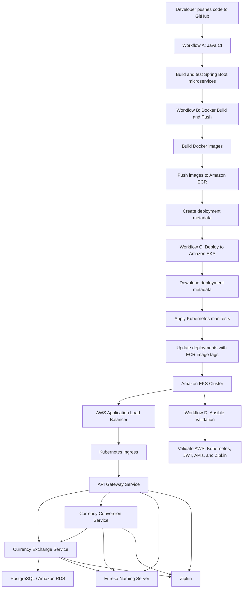

# End-to-End System Diagram

This document explains the full end-to-end flow of the project, from code change to deployed microservices on AWS.

The goal of this diagram is to show how GitHub Actions, Docker, Amazon ECR, Amazon EKS, Kubernetes, Spring Boot microservices, PostgreSQL/RDS, Zipkin, and Ansible work together.

---

## Full Project Flow



---

## Diagram Explanation

The project starts when a developer pushes code to GitHub.

GitHub Actions Workflow A builds and tests the Java Spring Boot microservices.

Workflow B starts after Workflow A succeeds. It builds Docker images for the selected services, pushes those images to Amazon ECR, and creates deployment metadata.

The deployment metadata contains important deployment information such as:

```text
Commit SHA
Short SHA
Docker image tag
AWS region
AWS account ID
Services selected for deployment
ECR repository names
Kubernetes deployment names
```

Workflow C downloads this deployment metadata and deploys the correct Docker image tags to Amazon EKS.

Inside Kubernetes, the API Gateway is the main entry point for application traffic.

External traffic flows like this:

```text
User
  ↓
AWS Application Load Balancer
  ↓
Kubernetes Ingress
  ↓
API Gateway
  ↓
Backend microservices
```

The API Gateway routes requests to the currency exchange service and currency conversion service.

The currency conversion service can call the currency exchange service to get exchange-rate data.

The currency exchange service connects to PostgreSQL / Amazon RDS for stored exchange-rate information.

The services use Eureka Naming Server for service discovery.

Zipkin collects distributed tracing data from the API Gateway and backend microservices.

After deployment, Workflow D runs Ansible validation playbooks to confirm that the deployed system is healthy and usable.

---

## Runtime Application Flow

The runtime request flow looks like this:

```text
User request
  ↓
AWS Application Load Balancer
  ↓
Kubernetes Ingress
  ↓
API Gateway
  ↓
Currency Conversion Service or Currency Exchange Service
  ↓
PostgreSQL / Amazon RDS
```

For currency conversion, the flow is:

```text
User calls currency conversion endpoint
  ↓
API Gateway routes request
  ↓
Currency Conversion Service receives request
  ↓
Currency Conversion Service calls Currency Exchange Service
  ↓
Currency Exchange Service reads exchange-rate data from PostgreSQL/RDS
  ↓
Currency Conversion Service calculates final value
  ↓
Response returns to user through API Gateway
```

---

## Deployment Flow

The deployment flow looks like this:

```text
Code pushed to GitHub
  ↓
Workflow A builds and tests Java services
  ↓
Workflow B builds Docker images
  ↓
Docker images are pushed to Amazon ECR
  ↓
Workflow B creates deployment metadata
  ↓
Workflow C deploys selected services to Amazon EKS
  ↓
Kubernetes pulls images from Amazon ECR
  ↓
Kubernetes rolls out updated pods
  ↓
Workflow D validates the deployment with Ansible
```

This creates a complete build, package, deploy, and validate process.

---

## Summary

This diagram connects the main parts of the project:

```text
GitHub Actions
Docker
Amazon ECR
Amazon EKS
Kubernetes
AWS Application Load Balancer
API Gateway
Spring Boot microservices
Eureka Naming Server
PostgreSQL / Amazon RDS
Zipkin
Ansible validation
```

The diagram shows how source code moves from GitHub to a running cloud deployment and how user traffic flows through the deployed microservices system.